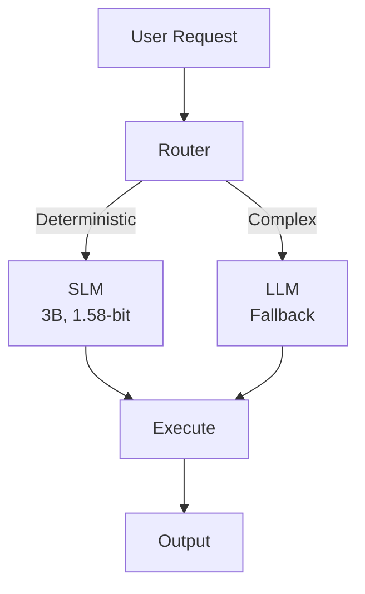

# Small Language Models are the Future of Agentic AI - Notes

## Core Thesis

**SLMs > LLMs for agentic workflows** when tasks are:
- Repetitive and structured
- Domain-specific
- Require low latency
- Cost-sensitive

## The Agentic AI Paradigm

### Traditional LLM Agents
```
User Request → LLM (reasoning) → Action → LLM (validation) → ...
```
**Problems:**
- Expensive (every step costs API calls)
- Slow (high latency per step)
- Overkill for deterministic tasks

### SLM-First Agentic Design
```
User Request → SLM (deterministic steps) → [LLM fallback only if needed]
```
**Benefits:**
- 10-100× cheaper
- 5-10× faster
- 90%+ tasks handled on-device

## Key Insights

### 1. Task Decomposition

Most agentic workflows can be broken into:
- **Deterministic steps** (80%): Perfect for SLMs
  - Data validation
  - Form filling
  - API calls
  - Status updates

- **Reasoning steps** (20%): Require LLM fallback
  - Ambiguous inputs
  - Creative generation
  - Complex decisions

### 2. Reliability Through Constraints

SLMs excel when workflows have:
-  Finite state machines
-  Explicit action spaces
-  Validation checkpoints
-  Error recovery paths

Example:
```python
class OnboardingAgent:
    def __init__(self, slm, llm_fallback):
        self.slm = slm
        self.llm = llm_fallback
        self.state = "START"

    def process_step(self, input):
        # Try SLM first
        action, confidence = self.slm.predict(input, self.state)

        if confidence > 0.85:
            return self.execute(action)
        else:
            # Fallback to LLM
            return self.llm.reason(input, self.state)
```

### 3. Benchmarking Agentic Performance

Traditional metrics (perplexity, accuracy) don't capture agent quality.

**Better metrics:**
- Task completion rate
- Steps to completion
- Fallback frequency
- Error recovery success
- Latency per action
- Cost per task

## Research Findings

| Task Type | SLM Success Rate | Cost vs LLM | Latency vs LLM |
|-----------|------------------|-------------|----------------|
| Invoice Processing | 95% | 0.01× | 0.1× |
| Customer Onboarding | 88% | 0.05× | 0.15× |
| Document Validation | 97% | 0.02× | 0.08× |
| Email Triage | 92% | 0.03× | 0.12× |

## My Research Application

### Proposed Architecture

**System Flow:**

1. **User Request** → Initial input enters the system
2. **Router** → Classifies task type and complexity
3. **Decision Point:** Routes to either:
   - **SLM** (3B parameters, 1.58-bit quantized) - For deterministic tasks
   - **LLM** (Cloud fallback) - For complex reasoning
4. **Execute** → Runs the selected action
5. **Output** → Returns result to user

**Architecture Diagram:**



**Key Components:**
- **Router**: Lightweight classifier to determine task complexity
- **SLM**: On-device model handles 80-90% of tasks
- **LLM Fallback**: Cloud-based model for edge cases only
- **Execute**: Action layer with validation checkpoints

### Workflow Example: Invoice Processing

1. **Input:** Scanned invoice PDF
2. **SLM Tasks:**
   - Extract vendor name ✓
   - Extract amount ✓
   - Extract date ✓
   - Validate format ✓
   - Check against database ✓
3. **LLM Fallback Triggers:**
   - Ambiguous handwriting
   - Vendor not in database
   - Unusual format
4. **Output:** Validated invoice data

## Implementation Strategy

### Training Data
- Procedural task datasets
- State transitions
- Error examples
- Recovery patterns

### Architecture Choices
- Use AFM-style backbone (3B)
- BitNet b1.58 quantization
- LoRA adapters per workflow
- Super weight preservation

### Evaluation Harness
```python
class AgenticEvaluator:
    def __init__(self):
        self.metrics = {
            'completion_rate': [],
            'avg_steps': [],
            'fallback_rate': [],
            'latency': [],
            'cost': []
        }

    def evaluate_workflow(self, agent, tasks):
        for task in tasks:
            result = agent.execute(task)
            self.metrics['completion_rate'].append(result.success)
            self.metrics['avg_steps'].append(result.steps)
            self.metrics['fallback_rate'].append(result.llm_calls / result.steps)
            self.metrics['latency'].append(result.time)
            self.metrics['cost'].append(result.compute_cost)
```

## Design Principles from Paper

1. **Graceful Degradation:** Always have LLM fallback
2. **Explicit State Management:** FSM > implicit reasoning
3. **Confidence Thresholding:** Know when to escalate
4. **Audit Trails:** Log every decision for debugging
5. **Incremental Deployment:** Start with high-confidence tasks

## Challenges & Solutions

| Challenge | Solution |
|-----------|----------|
| SLM hallucination | Constrained output spaces |
| Error propagation | Validation checkpoints every N steps |
| Context limitations | Compress state, not raw history |
| Adaptation to new tasks | Quick LoRA fine-tuning |

## Key Quotes

> "The future of agentic AI is not about making LLMs faster—it's about using them less."

> "Small models with clear objectives beat large models with vague ones."

## Next Steps for My Research

- [ ] Build proof-of-concept for invoice processing
- [ ] Implement FSM scaffolding framework
- [ ] Create evaluation harness
- [ ] Compare SLM vs LLM on 5 workflows
- [ ] Measure: completion rate, latency, cost

---

**Status:** Read - Core methodology for my thesis
**Read Date:** January 2025
